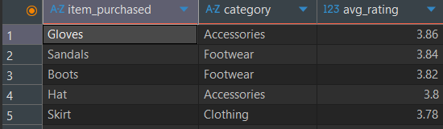
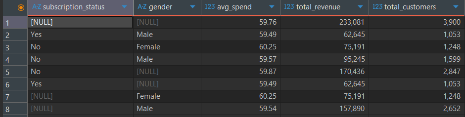
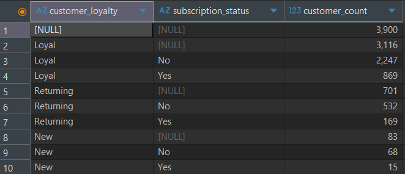
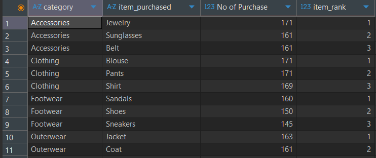
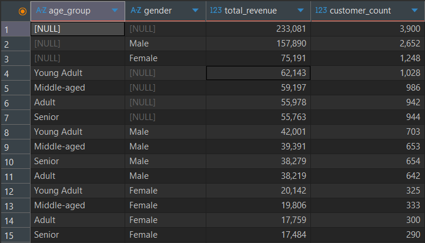

# Retail Sales & Customer Behavior Analysis

## SQL Analysis
### 1. Top Rated Products
Business Question:
Which products have the highest average customer review ratings?

SQL File: [Link to SQL Query](1_top_rated_products.sql)  
Output:  

Insight:
- Accessories and Footwear dominate the highest-rated products.
- Ratings are tightly clustered (3.78 to 3.86), indicating moderate but not exceptional satisfaction.

Business Interpretation:
- These products reflect relatively stronger customer satisfaction.
- However, average ratings below 4.0 suggest room for quality improvement.

Actionable Recommendations:
- Promote high-rated products in marketing campaigns.
- Investigate why ratings are not exceeding 4.0 (quality, delivery, pricing).
- Use top-rated products as benchmark for underperforming items.

### 2. Subscription Spend Analysis

Business Question:
How does spending differ between subscribers and non-subscribers across genders?

SQL File: [Link to SQL Query](2_subscription_spend_analysis.sql)  
Output:  

Insight:
- There are no female customers enrolled in the subscription program.
- Female customers have the highest average spend (~$60.25) despite not subscribing.
- Average spend across subscribers and non-subscribers is nearly identical (~$59–60).
- Total revenue from non-subscribers is higher due to larger customer volume.

Business Interpretation:
- Either the subscription benefits are not appealing to female customers,
or the subscription program is not being effectively targeted or marketed to them.
- Female customers spend slightly more on average than males
and average spend is similar between subscribers and non-subscribers.
- The subscription program does not appear to meaningfully increase per-customer spending.
- Revenue difference is driven by customer count, not by subscription impact.

Actionable Recommendations:
- Investigate why female customers are not subscribing despite higher average spend.
- Run targeted subscription campaigns for female customers.
- Reassess whether the subscription program is improving spending behavior.
- Enhance subscription benefits to make the value clearer.
- Analyze whether subscription increases purchase frequency, not just average spend.

### 3. Customer Loyalty Segmentation

Business Question:
How are customers distributed across New, Returning, and Loyal segments, and how does subscription vary within these groups?

SQL File: [Link to SQL Query](3_customer_loyalty_segmentation.sql)  
Output:  

Insight:
- 3,116 customers are categorized as Loyal.
- However, 2,247 loyal customers are non-subscribers.
- Only 869 loyal customers have subscriptions.

Business Interpretation:
- High loyalty does not translate into subscription adoption.
- Subscription value proposition is weak.
- Loyal customers may not perceive additional benefit from subscribing.

Actionable Recommendations:
- Target loyal non-subscribers with exclusive benefits.
- Offer loyalty-based subscription discounts.
- Bundle subscription with rewards or faster shipping.

### 4. Top Products by Category

Business Question:
Which products are most frequently purchased within each category?

SQL File: [Link to SQL Query](4_top_products_by_category.sql)  
Output:  

Insight:
- Clothing category shows consistently high purchase frequency.
- Accessories and Footwear also show strong demand concentration.
- Certain items dominate within categories.

Business Interpretation:
- Inventory planning should prioritize high-frequency products.

Actionable Recommendations:
- Maintain higher stock levels for top-ranked items.
- Investigate whether top sellers also yield high profit margins.

### 5. Revenue by Age and Gender

Business Question:
How is revenue distributed across age groups and gender segments?

SQL File: [Link to SQL Query](5_age_gender_revenue_analysis.sql)  
Output:  

Insight:
- Male customers generate ~68% of total revenue. This is primarily due to higher customer count.
- Young Adults are the highest revenue-generating age group. Seniors contribute the least revenue.
- Revenue distribution across age groups is relatively balanced, but Young Adults have slight dominance.

Business Interpretation:
- Marketing campaigns can be tailored toward Young Adults.
- There is growth opportunity in the Senior segment.
- Gender-based marketing may increase female participation.

Actionable Recommendations:
- Targeted promotions for Seniors.
- Segment-specific product recommendations.
- Age-based personalization in campaigns.

These SQL analyses were used to validate patterns before building the Power BI dashboard and helped shape the final KPIs and segmentation logic.
